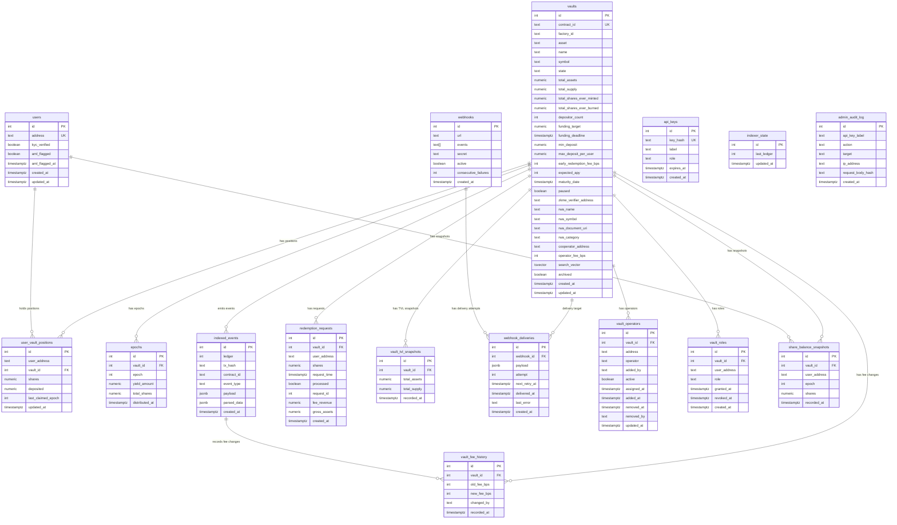

# Database Schema

> Auto-generated from migration files in `src/db/migrations/`.

## Entity-Relationship Diagram

## Tables

### `vaults`

Core vault entity. Tracks RWA vault lifecycle from Funding through Active, Matured, Closed, or Cancelled.

| Column | Type | Nullable | Default | Description |
|---|---|---|---|---|
| `id` | `SERIAL` | NOT NULL | — | Primary key |
| `contract_id` | `TEXT` | NOT NULL | — | Unique Stellar contract identifier |
| `factory_id` | `TEXT` | YES | — | Factory contract that deployed this vault |
| `asset` | `TEXT` | NOT NULL | — | Underlying asset identifier |
| `name` | `TEXT` | YES | — | Vault display name |
| `symbol` | `TEXT` | YES | — | Vault ticker symbol |
| `state` | `TEXT` | NOT NULL | `'Funding'` | One of: Funding, Active, Matured, Closed, Cancelled |
| `total_assets` | `NUMERIC` | YES | `0` | Total assets under management |
| `total_supply` | `NUMERIC` | YES | `0` | Total share token supply |
| `total_shares_ever_minted` | `NUMERIC` | NOT NULL | `0` | Lifetime minted shares |
| `total_shares_ever_burned` | `NUMERIC` | NOT NULL | `0` | Lifetime burned shares |
| `depositor_count` | `INT` | YES | — | Unique depositor count |
| `funding_target` | `NUMERIC` | YES | — | Target amount for funding round |
| `funding_deadline` | `TIMESTAMPTZ` | YES | — | Funding round deadline |
| `min_deposit` | `NUMERIC` | YES | — | Minimum deposit amount |
| `max_deposit_per_user` | `NUMERIC` | YES | — | Per-user deposit cap |
| `early_redemption_fee_bps` | `INT` | YES | `0` | Early redemption fee in basis points |
| `expected_apy` | `INT` | YES | — | Advertised APY in basis points |
| `maturity_date` | `TIMESTAMPTZ` | YES | — | Expected maturity date |
| `paused` | `BOOLEAN` | YES | `false` | Pause/unpause state |
| `zkme_verifier_address` | `TEXT` | YES | — | zkMe KYC verifier contract address |
| `rwa_name` | `TEXT` | YES | — | RWA asset name |
| `rwa_symbol` | `TEXT` | YES | — | RWA asset symbol |
| `rwa_document_uri` | `TEXT` | YES | — | URI to RWA documentation |
| `rwa_category` | `TEXT` | YES | — | RWA category label |
| `cooperator_address` | `TEXT` | YES | — | On-chain cooperator address |
| `operator_fee_bps` | `INT` | YES | `0` | Operator fee in basis points |
| `search_vector` | `TSVECTOR` | YES | — | Generated full-text search vector (name + symbol) |
| `archived` | `BOOLEAN` | NOT NULL | `false` | Soft-delete flag |
| `created_at` | `TIMESTAMPTZ` | YES | `NOW()` | Row creation timestamp |
| `updated_at` | `TIMESTAMPTZ` | YES | `NOW()` | Row last-update timestamp |

**Primary key:** `id`  
**Unique constraints:** `contract_id`  
**Indexes:**
- `idx_vaults_rwa_category` on `(rwa_category)`
- `idx_vaults_search_vector` GIN on `(search_vector)`
- `idx_vaults_name_trgm` GIN on `(name gin_trgm_ops)`
- `idx_vaults_rwa_name_trgm` GIN on `(rwa_name gin_trgm_ops)`
- `idx_vaults_state` on `(state)`
- `vaults_state_assets_idx` on `(state, total_assets DESC)`
- `idx_vaults_archived_updated_at` on `(archived, updated_at DESC)`

---

### `users`

Registered user identities with KYC/AML status.

| Column | Type | Nullable | Default | Description |
|---|---|---|---|---|
| `id` | `SERIAL` | NOT NULL | — | Primary key |
| `address` | `TEXT` | NOT NULL | — | Stellar wallet address |
| `kyc_verified` | `BOOLEAN` | YES | `false` | KYC verification status |
| `aml_flagged` | `BOOLEAN` | NOT NULL | `false` | AML flag status |
| `aml_flagged_at` | `TIMESTAMPTZ` | YES | — | Timestamp of AML flag |
| `created_at` | `TIMESTAMPTZ` | YES | `NOW()` | Row creation timestamp |
| `updated_at` | `TIMESTAMPTZ` | YES | `NOW()` | Row last-update timestamp |

**Primary key:** `id`  
**Unique constraints:** `address`

---

### `user_vault_positions`

Tracks each user's share balance and deposit per vault.

| Column | Type | Nullable | Default | Description |
|---|---|---|---|---|
| `id` | `SERIAL` | NOT NULL | — | Primary key |
| `user_address` | `TEXT` | NOT NULL | — | Stellar wallet address |
| `vault_id` | `INT` | NOT NULL | — | References `vaults(id)` |
| `shares` | `NUMERIC` | YES | `0` | Current share balance |
| `deposited` | `NUMERIC` | YES | `0` | Total deposited amount |
| `last_claimed_epoch` | `INT` | YES | `0` | Last epoch yield was claimed for |
| `updated_at` | `TIMESTAMPTZ` | YES | `NOW()` | Row last-update timestamp |

**Primary key:** `id`  
**Unique constraints:** `(user_address, vault_id)`  
**Foreign keys:** `vault_id` → `vaults(id)`  
**Indexes:**
- `uvp_vault_shares_idx` on `(vault_id, shares DESC)`

---

### `epochs`

Yield distribution epochs per vault.

| Column | Type | Nullable | Default | Description |
|---|---|---|---|---|
| `id` | `SERIAL` | NOT NULL | — | Primary key |
| `vault_id` | `INT` | NOT NULL | — | References `vaults(id)` |
| `epoch` | `INT` | NOT NULL | — | Epoch number |
| `yield_amount` | `NUMERIC` | NOT NULL | — | Yield distributed in this epoch |
| `total_shares` | `NUMERIC` | NOT NULL | — | Total shares at distribution time |
| `distributed_at` | `TIMESTAMPTZ` | YES | — | Distribution timestamp |

**Primary key:** `id`  
**Unique constraints:** `(vault_id, epoch)`  
**Foreign keys:** `vault_id` → `vaults(id)`

---

### `indexed_events`

Raw on-chain events indexed by the indexer service.

| Column | Type | Nullable | Default | Description |
|---|---|---|---|---|
| `id` | `SERIAL` | NOT NULL | — | Primary key |
| `ledger` | `INT` | NOT NULL | — | Stellar ledger sequence number |
| `tx_hash` | `TEXT` | NOT NULL | — | Transaction hash |
| `contract_id` | `TEXT` | NOT NULL | — | Emitting contract address |
| `event_type` | `TEXT` | NOT NULL | — | Event type string |
| `payload` | `JSONB` | NOT NULL | — | Raw event payload |
| `parsed_data` | `JSONB` | YES | — | Pre-computed derived fields |
| `created_at` | `TIMESTAMPTZ` | YES | `NOW()` | Row creation timestamp |

**Primary key:** `id`  
**Indexes:**
- `idx_indexed_events_contract_event` on `(contract_id, event_type)`
- `ie_created_at_idx` on `(created_at DESC)`

---

### `redemption_requests`

Early redemption requests made by users.

| Column | Type | Nullable | Default | Description |
|---|---|---|---|---|
| `id` | `SERIAL` | NOT NULL | — | Primary key |
| `vault_id` | `INT` | NOT NULL | — | References `vaults(id)` |
| `user_address` | `TEXT` | NOT NULL | — | Requestor address |
| `shares` | `NUMERIC` | NOT NULL | — | Shares to redeem |
| `request_time` | `TIMESTAMPTZ` | NOT NULL | — | On-chain request timestamp |
| `processed` | `BOOLEAN` | YES | `false` | Whether the request was processed |
| `request_id` | `INTEGER` | YES | — | On-chain request ID |
| `fee_revenue` | `NUMERIC` | YES | `0` | Early redemption fee revenue |
| `gross_assets` | `NUMERIC` | YES | `0` | Gross assets at redemption |
| `created_at` | `TIMESTAMPTZ` | YES | `NOW()` | Row creation timestamp |

**Primary key:** `id`  
**Unique constraints:** `(vault_id, user_address, request_time)`  
**Foreign keys:** `vault_id` → `vaults(id)`  
**Indexes:**
- `idx_redemption_requests_vault_processed` on `(vault_id, processed)`
- `idx_redemption_requests_request_time` on `(request_time)`
- `idx_redemption_requests_vault_request` on `(vault_id, request_id)`

---

### `webhooks`

Configured webhook endpoints for event notifications.

| Column | Type | Nullable | Default | Description |
|---|---|---|---|---|
| `id` | `SERIAL` | NOT NULL | — | Primary key |
| `url` | `TEXT` | NOT NULL | — | Webhook callback URL (HTTPS only) |
| `events` | `TEXT[]` | NOT NULL | — | Array of subscribed event types |
| `secret` | `TEXT` | YES | — | HMAC signing secret |
| `active` | `BOOLEAN` | YES | `true` | Whether the webhook is active |
| `consecutive_failures` | `INT` | NOT NULL | `0` | Consecutive delivery failures |
| `created_at` | `TIMESTAMPTZ` | YES | `NOW()` | Row creation timestamp |

**Primary key:** `id`

---

### `webhook_deliveries`

Delivery attempt log for webhook notifications.

| Column | Type | Nullable | Default | Description |
|---|---|---|---|---|
| `id` | `SERIAL` | NOT NULL | — | Primary key |
| `webhook_id` | `INT` | NOT NULL | — | References `webhooks(id)` |
| `payload` | `JSONB` | NOT NULL | — | Delivered payload |
| `attempt` | `INT` | NOT NULL | `1` | Attempt number |
| `next_retry_at` | `TIMESTAMPTZ` | YES | — | Next scheduled retry |
| `delivered_at` | `TIMESTAMPTZ` | YES | — | Successful delivery timestamp |
| `last_error` | `TEXT` | YES | — | Last error message |
| `created_at` | `TIMESTAMPTZ` | YES | `NOW()` | Row creation timestamp |

**Primary key:** `id`  
**Foreign keys:** `webhook_id` → `webhooks(id)`  
**Indexes:**
- `idx_webhook_deliveries_retry` on `(next_retry_at)` WHERE `delivered_at IS NULL AND attempt < 6`

---

### `share_balance_snapshots`

Periodic snapshot of user share balances at epoch boundaries.

| Column | Type | Nullable | Default | Description |
|---|---|---|---|---|
| `id` | `SERIAL` | NOT NULL | — | Primary key |
| `vault_id` | `INT` | NOT NULL | — | References `vaults(id)` |
| `user_address` | `TEXT` | NOT NULL | — | Stellar wallet address |
| `epoch` | `INT` | NOT NULL | — | Epoch number |
| `shares` | `NUMERIC` | NOT NULL | — | Share balance at snapshot |
| `recorded_at` | `TIMESTAMPTZ` | NOT NULL | `NOW()` | Snapshot timestamp |

**Primary key:** `id`  
**Unique constraints:** `(vault_id, user_address, epoch)`, also `(user_address, vault_id, epoch)`  
**Foreign keys:** `vault_id` → `vaults(id)` ON DELETE CASCADE  
**Indexes:**
- `idx_share_balance_snapshots_user_vault_epoch` on `(user_address, vault_id, epoch)`
- `idx_share_balance_snapshots_user_epoch` on `(user_address, epoch)`

---

### `vault_operators`

Operator assignments per vault (two migration versions exist).

| Column | Type | Nullable | Default | Description |
|---|---|---|---|---|
| `id` | `SERIAL` | NOT NULL | — | Primary key |
| `vault_id` | `INT` | NOT NULL | — | References `vaults(id)` |
| `operator` | `TEXT` | YES | — | Operator address (migration 017) |
| `address` | `TEXT` | YES | — | Operator address (migration 014) |
| `added_by` | `TEXT` | YES | — | Address that added the operator |
| `active` | `BOOLEAN` | YES | `true` | Whether the operator is active |
| `assigned_at` | `TIMESTAMPTZ` | YES | `NOW()` | When the operator was assigned |
| `added_at` | `TIMESTAMPTZ` | YES | `NOW()` | When the operator was added |
| `removed_at` | `TIMESTAMPTZ` | YES | — | When the operator was removed |
| `removed_by` | `TEXT` | YES | — | Address that removed the operator |
| `created_at` | `TIMESTAMPTZ` | NOT NULL | `NOW()` | Row creation timestamp |
| `updated_at` | `TIMESTAMPTZ` | NOT NULL | `NOW()` | Row last-update timestamp |

**Primary key:** `id`  
**Unique constraints:** `(vault_id, address)` and `(vault_id, operator)`  
**Foreign keys:** `vault_id` → `vaults(id)` ON DELETE CASCADE  
**Indexes:**
- `idx_vault_operators_vault_id` on `(vault_id)`
- `idx_vault_operators_vault_operator` on `(vault_id, operator)`

---

### `vault_roles`

Role-based access control entries per vault.

| Column | Type | Nullable | Default | Description |
|---|---|---|---|---|
| `id` | `SERIAL` | NOT NULL | — | Primary key |
| `vault_id` | `INT` | NOT NULL | — | References `vaults(id)` |
| `user_address` | `TEXT` | NOT NULL | — | Wallet address |
| `role` | `TEXT` | NOT NULL | — | Role name |
| `granted_at` | `TIMESTAMPTZ` | NOT NULL | `NOW()` | When the role was granted |
| `revoked_at` | `TIMESTAMPTZ` | YES | — | When the role was revoked |
| `created_at` | `TIMESTAMPTZ` | NOT NULL | `NOW()` | Row creation timestamp |

**Primary key:** `id`  
**Unique constraints:** `(vault_id, user_address, role)`  
**Foreign keys:** `vault_id` → `vaults(id)`  
**Indexes:**
- `idx_vault_roles_vault_id` on `(vault_id)`
- `idx_vault_roles_vault_user` on `(vault_id, user_address)`

---

### `vault_fee_history`

Audit trail of operator fee rate changes.

| Column | Type | Nullable | Default | Description |
|---|---|---|---|---|
| `id` | `SERIAL` | NOT NULL | — | Primary key |
| `vault_id` | `INT` | NOT NULL | — | References `vaults(id)` |
| `old_fee_bps` | `INT` | NOT NULL | — | Previous fee in basis points |
| `new_fee_bps` | `INT` | NOT NULL | — | New fee in basis points |
| `changed_by` | `TEXT` | NOT NULL | — | Address that made the change |
| `recorded_at` | `TIMESTAMPTZ` | YES | `NOW()` | Change timestamp |

**Primary key:** `id`  
**Foreign keys:** `vault_id` → `vaults(id)`  
**Indexes:**
- `idx_vault_fee_history_vault_id` on `(vault_id, recorded_at DESC)`

---

### `vault_tvl_snapshots`

Historical TVL (total value locked) snapshots.

| Column | Type | Nullable | Default | Description |
|---|---|---|---|---|
| `id` | `SERIAL` | NOT NULL | — | Primary key |
| `vault_id` | `INT` | NOT NULL | — | References `vaults(id)` |
| `total_assets` | `NUMERIC` | NOT NULL | — | Total assets at snapshot |
| `total_supply` | `NUMERIC` | NOT NULL | — | Total supply at snapshot |
| `recorded_at` | `TIMESTAMPTZ` | YES | `NOW()` | Snapshot timestamp |

**Primary key:** `id`  
**Foreign keys:** `vault_id` → `vaults(id)`  
**Indexes:**
- `idx_vault_tvl_snapshots_vault_id_recorded_at` on `(vault_id, recorded_at)`

---

### `api_keys`

API keys for programmatic access.

| Column | Type | Nullable | Default | Description |
|---|---|---|---|---|
| `id` | `SERIAL` | NOT NULL | — | Primary key |
| `key_hash` | `TEXT` | NOT NULL | — | Hashed API key value |
| `label` | `TEXT` | NOT NULL | — | Human-readable label |
| `role` | `TEXT` | NOT NULL | — | Role: `admin` or `readonly` |
| `expires_at` | `TIMESTAMPTZ` | YES | — | Key expiration timestamp |
| `created_at` | `TIMESTAMPTZ` | YES | `NOW()` | Row creation timestamp |

**Primary key:** `id`  
**Unique constraints:** `key_hash`  
**Check constraints:** `role IN ('admin', 'readonly')`

---

### `indexer_state`

Tracks the indexer's last processed ledger for resumability.

| Column | Type | Nullable | Default | Description |
|---|---|---|---|---|
| `id` | `SERIAL` | NOT NULL | — | Primary key |
| `last_ledger` | `INT` | NOT NULL | `0` | Last processed ledger sequence |
| `updated_at` | `TIMESTAMPTZ` | YES | `NOW()` | Last-update timestamp |

**Primary key:** `id`

---

### `admin_audit_log`

Audit trail for admin API actions.

| Column | Type | Nullable | Default | Description |
|---|---|---|---|---|
| `id` | `SERIAL` | NOT NULL | — | Primary key |
| `api_key_label` | `TEXT` | YES | — | Label of the API key used |
| `action` | `TEXT` | NOT NULL | — | Action performed |
| `target` | `TEXT` | NOT NULL | — | Target resource identifier |
| `ip_address` | `TEXT` | YES | — | Requesting IP address |
| `request_body_hash` | `TEXT` | NOT NULL | — | SHA hash of the request body |
| `created_at` | `TIMESTAMPTZ` | YES | `NOW()` | Row creation timestamp |

**Primary key:** `id`
